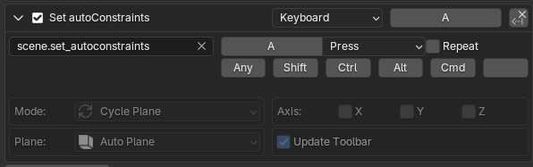

# Hotkeys
!!! info "Hotkeys should 'Just Work'"
    No manual hotkey work should be required to use this addon. This page is for:
    
    - Customizing or adding new hotkeys
    - Hotkeys aren't working or there are conflicts with other add-ons

## Add-on Specific Hotkeys
### Toggle Constraints
The toggle constraints hotkey can be changed via the add-on preferences:

1. Navigate to the add-on Preferences under **Edit/Preferences/Add-ons**
2. Find and expand the entry for **autoConstraints**
3. Under **Keymap Settings** there is an entry for **Toggle Constriants**. Simply click the box and perform the desired shortcut.

### Specify Constraints (1.4+)
You can assign hotkeys to apply specific constraints or cycle through constraint planes. Set these up using Blender's keymap editor:

1. Open the keymap editor under **Edit/Preferences/Keymaps**
2. Navigate to **3D View/3D View (Global)** (or wherever you wish to make the keymap)
3. Scroll down to the bottom of the category and click "**Add New**"
4. Select the operator "**scene.set_autoconstraints**" and choose a hotkey
5. Configure operator settings to apply the desired constraints

#### Mode
Determines the mode of the operator, options are:

- Cycle Plane: Will cycle through constraint planes from AUTO > XY > XZ > YZ > ...
- Specify Plane: Will set the constraint plane to the one specified in the [Plane](#plane) option
- Specify Axes: Will apply axis-override constraints based on the [Axis](#axis) option
- Clear Overrides: Clears any axis overrides and returns to the last used constraint plane

#### Axis
Used when [Mode](#mode) is set to "Specify Axes". Choose which individual axes to constrain to.

#### Plane
Used when [Mode](#mode) is set to "Specify Plane". Choose which plane to constrain to.

#### Update Toolbar
Leave this on unless you have disabled the autoConstraints toolbar

----
## Advanced Keymap Editing

autoConstraints works by wrapping existing transform operators into new operators that first calculate constraints to apply and then invoke the existing transform operator.

By default autoConstraints will override existing keymaps for all transform operators it applies to. Any custom keymaps you had will be respected and existing keymaps are never deleted, only disabled and fully restored when the add-on is disabled/uninstalled

### Changing Transform keymaps

To change keymaps for transform operators, **ignore the autoConstraint keymaps**.

Change the keymaps for the original transform operators in the usual way and then refresh the autoConstraints keymaps by either:

- disabling/re-enabling the add-on
- Toggling "Auto-Override Keymap" in the add-on preferences under Keymap Settings

### Disabling automatic keymaps
If you wish to set up all the keymaps manually you can turn off the automatic keymaps with the option "Auto-Override Keymap" in the [add-on preferences](preferences.md#keymap-settings) under Keymap Settings.

You can then manually set up hotkeys for each autoConstraints operator.

For a quick reference of all the operators there is a sidebar panel you can enble that has a button for each operator. Simply turn on "Show Operator Button Sidebar" in the advanced section of the add-on preferences.

{width="535"}