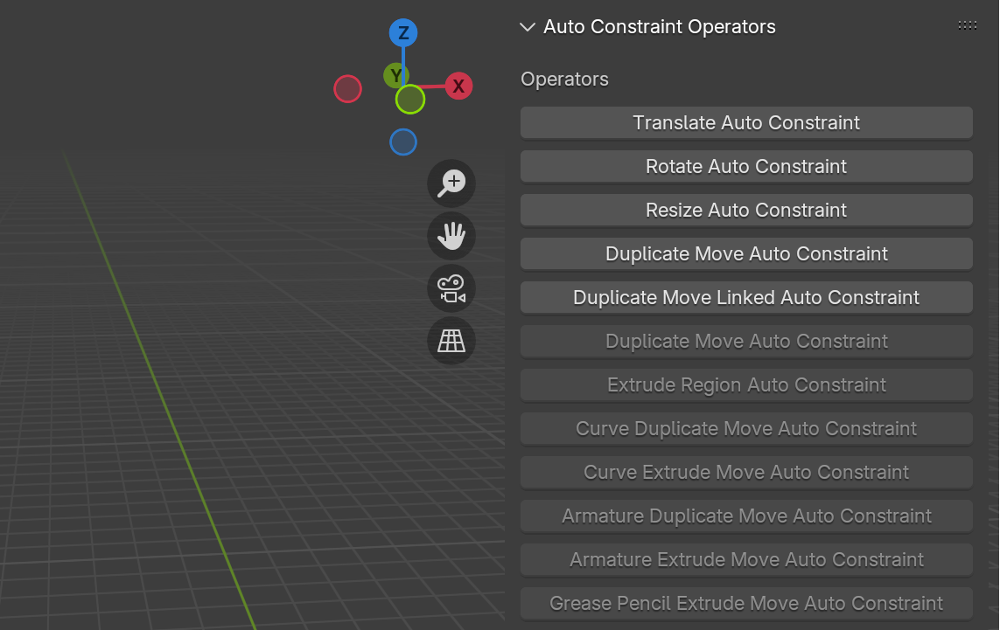

You can find the add-on's preferences by going to **Edit/Preferences/Add-ons** and expanding the entry for **autoConstraints**

## UI Settings
Here you'll find settings to customize the add-on's UI.
#### Toolbar Location
Where the toolbar is located. Default is the 3D View Tool Header, you can move it to the 3D View Header or disable the toolbar.

#### Toolbar Mode
Choose between "Expanded" (Default) or "Compact" toolbar

#### Icon Style
Changes the icons of planes across the add-on

{ width="400"}
#### Show Sidebar
Places autoConstraints UI in a sidebar. Useful if toolbar is turned off

----
## Keymap Settings
Keymap preferences, for more information see [hotkeys](hotkeys.md)
#### Auto Override Keymap
On by default this will override many existing hotkeys with their autoConstraint counterpart. If you wish to manually assign hotkeys to autoConstraint operators you can disable this. For a full list of autoConstraints operators you can turn on the [Operator Button Sidebar](#show-operator-button-sidebar)
#### Toggle Constraints
Configure the hotkey assigned to toggling autoConstraints globally

----
## Advanced Settings
#### Show Operator Button Sidebar
Shows a sidebar with a button for each of the autoConstraints operators

#### Enable Axis Bias Options
Adds a setting to the UI to enable the biasing of the "Automatic" plane constraints. The values bias the **view direction**, for example to bias towards the ground plane you can increase the "Z" value
