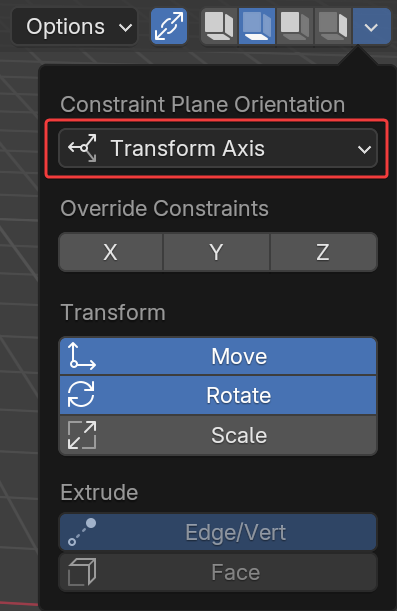

## Getting Started
To get started, simply use Blender as you usually would, transforms will be automatically constrained to a plane based on your view angle.

To turn off automatic constraints you can press the { width="16" } icon in the top bar. Alternatively you can use the shortcut ++shift+alt+x++. This can be configured in add-on preferences, see [Hotkeys](hotkeys.md#toggle-constraints)

??? abstract "UI cheatsheet (click to expand)"
    

## Constraint Planes
By default transformations will be constrained to a 2D plane based on:

- The viewing angle in the 3D viewport
- The selected transform orientation

The automatic plane will be in the selected transform orientation based on the most perpendicular axes to the view angle:

### Specifying The Constraint Plane
To always use the same constraint-plane you can specify planes directly from the toolbar. These options will be in the dropdown if you are using the compact toolbar.

- { width="20" } Constrain to the automatic plane
- { width="20" } Constrain to the XY plane
- { width="20" } Constrain to the XZ plane
- { width="20" } Constrain to the YZ plane

To better tell the planes apart by their icons, there is an option in the add-on preferences to use colored icons: { width="100"}

It is possible to assign hotkeys to specific planes, see [Hotkeys](hotkeys.md#specify-constraints-14)

### Constraint Plane Orientation
When specifying a constraint plane, constraints are applied directly to the current transform orientation. You can change it so that the specified constraint plane is in global space and constraints will use best matching plane.

{ width="250"}

- **Transform Axis:** Use specified constraint plane directly
- **Closest to Global:** Use the closest plane in the current transform orientation to the specified plane in global space

## Constraint Axes
You can override the constraint planes altogether by specifying individual axes. These constraints are always applied directly to the current transform orientation.

{ width="250"}

To go back to constraint planes, simply toggle all axes off.    
It is possible to assign hotkeys to specific axis combinations, see [Hotkeys](hotkeys.md#specify-constraints-14){ width="250" }

